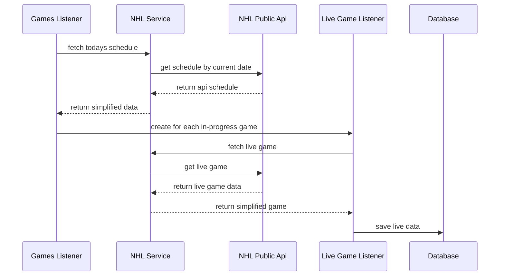

A proof data ingest for nhl data using the nhl public api.  

## Getting Started

### Create database

The database is sqllite database that consists one table `GameData`.  To create the database and table run:

```
yarn createGameData
```

### Test

```
yarn test
```

### Run

```
yarn start
```
## Design



### Games Listener
A Schedule Cron Job that retrieves the schedule games for the day.  If there are games that are in-progress, the listener will create a listener for each in-progress game.  The Listener manages all the in-progress game listeners and is responsible for tracking and cleaning up all live game listeners.

### Live Game Listener
A Cron Job that fetches the live game data from the NHL Service and processes the return data and saves a snapshot of the data at that time to a SqlLite database.
### NHL Service
Interface to pull data from the NHL Public API.  This service is responsible for processing data returned from the public api and condensing it into smaller objects to be used by the caller of the service.
### NHL Public API
Use to fetch raw live game data to ingest into the database.
### Database
SqlLite database that store a snapshoot of player stats.
```typescript
export interface GameDataModel {
  playerId: string;
  playerName: string;
  teamId: string;
  teamName: string;
  playerAge?: string;
  playerNumber: string;
  playerPosition: string;
  assists: string;
  goals: string;
  hits: string;
  points: string;
  penaltyMinutes: string;
  opponentTeam: string;
  createdUnixTime?: number; //unix timestamp integer
```
